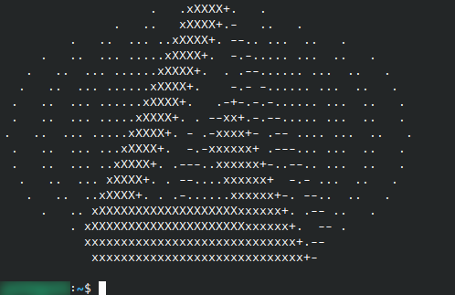

# ascii_display

ascii_display is a simple commandline utility written in rust,\
which displays a randomly selected ascii image (*each stored in a separate file in ~/.ascii_display*) when called.

## Installation

You can either use `make install` or `./install.sh` to build the script, add it to ~/.local/bin/ and .bashrc, \
or manually build it and use it in any other way.

## Usage

After installation the script should automatically be run whenever you open a new terminal \
